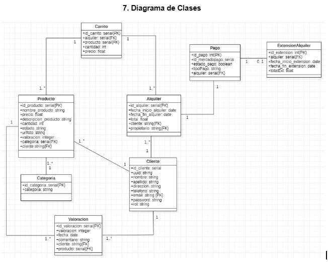

# Proyecto Final - Taller de integración - UADER FCYT 

Este proyecto trata de una tienda de alquiler (rental store), en donde se pueden alquilar productos para motivos vacacionales, deportivos, de camping, de reparación hogareña(herramientas) entre otros.. 

Donde se puede:
- Ver un listado completo de productos desde la pantalla principal.
- Ordenar por categoría (Artículos de playa, camping, deportivos, herramientas).
- Filtrar por precio (mayor precio o menor precio).
- Buscar algún producto en particular desde el buscador de productos.
- Ver el detalle de un producto en particular cliquando sobre la imágen del producto.
- En el detalle de producto, se puede ver la descripción del mismo, el precio del alquiler por día, quien es el dueño del mismo, y la valoración que posee, además de los comentarios.
- En la pantalla principal, cliqueando en el botón añadir a carrito el usuario podrá agregar los productos que desee alquilar.
- Para añadir los mismos el usuario debe estar registrado en la página.
- El sistema posee un control de stock, que avisará al usuario si el producto está fuera de stock en pantalla al agregarlo al carrito.
- Este sistema contiene un registro y login con google haciendo uso de Firebase.
- El sistema de pago utilizado es el de Mercadopago (Checkout pro)
- El sistema permite dar de alta, baja y modificar productos.
- El sistema permite modificar el usuario.
- Cancelación por parte del usuario.
- Posee un aviso automático al email del usuario cuando se está por vencer un alquiler.
- Posee un sistema de valoración y comentarios.
- Posee un calendario con las fechas de inicio y fin de un alquiler.
- Posee un apartado para poder ampliar la fecha de alquiler.

## Actualizaciones a futuro

- Agregar un chat usuario-propietario
- Sistema de niveles para conseguir mejoras según la progresión en alquileres.

## Librerías utilizadas

- Esta aplicación está desarrollada haciendo uso de diferentes frameworks, como por ejemplo del lado del back-end, se utilizó nodejs con librerías tales como Express js, node-cron, Nodemailer. En la parte del front-end se utilizó React, Bootstrap, Antdesing y PrimeReact; y así como también se hizo uso de una base de datos relacional en PostgreSQL; se utilizó Firebase para hacer la autenticación de usuarios y Mercadopago como método de pago para alquiler de productos.

## Diagrama de clases

## Visualización de funcionamiento

Para visualizar el funcionamiento, se dejan a continuación una serie de gifs que muestran de manera resumida el funcionamiento de la página de alquileres.

### Registro, Inicio, y Cierre de Sesión

### Busqueda, Filtrado, Ordenamiento y Selección de un producto

### Selección de Producto y Funcionamiento del Carrito de Compras

### Finalización de la Compra

### Acceso "Mis alquileres" y visualización del detalle del alquiler